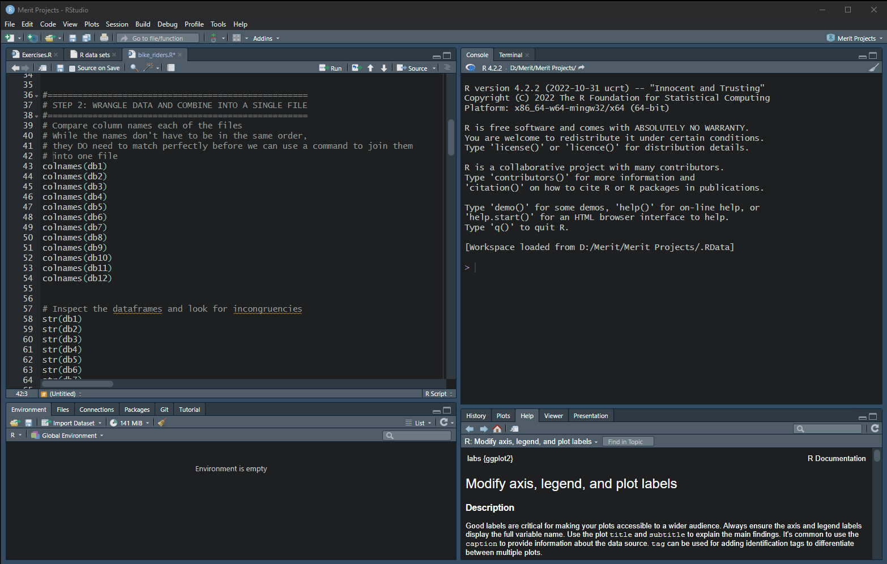

# R Studio
* Luckily this is the easiest part and has the most concise set of instructions. The instructions are dated but still helpful.
* In truth it may be possible just using R. However I use the IDE and suggest you do the same.
* Here they are [R Script](https://docs.google.com/document/d/1TTj5KNKf4BWvEORGm10oNbpwTRk1hamsWJGj6qRWpuI/edit)

## Installation

  
Software

### Click here ➡️ [R](https://cloud.r-project.org/bin/windows/base/R-4.3.0-win.exe)

* I created an auto download link becuase I find CRAN website confusing 😵     
* Keep in mind R does not auto update.
* Run through the setup keeping all default settings.

### Click here ➡️ [R Studio](https://download1.rstudio.org/electron/windows/RStudio-2023.06.0-421.exe)
* I created an auto download link becuase why not.
* Keep in mind RStudio does not auto update, nor do the libraries. 
* Run through the setup keeping all default settings.

I prefer this pane layout. I ask you consider it yourself. However it is all preference: 

## Uploading 

## Cleaning

## Analysis

## Exporting
