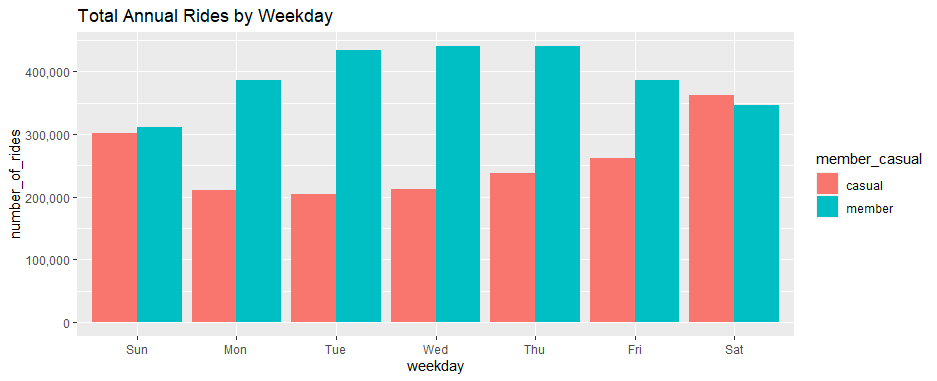
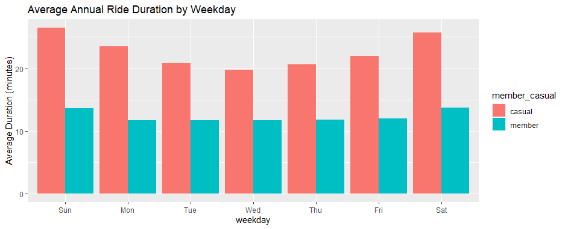

# R Studio                                
* This option has instructions, which is what we will be covering; parts of the instructions are dated, while other parts are outright wrong and not based on how the "Process" steps for the CSV files. I still suggest you see if it works for you and/or use it as a template; it is helpful in that way. However, the instructions set me up for confusion 😵.
* In truth, it may be possible to finish this just by using R. However, I use the IDE RStudio and suggest you do the same.
* Here are the instructions: [R Script](https://docs.google.com/document/d/1TTj5KNKf4BWvEORGm10oNbpwTRk1hamsWJGj6qRWpuI/edit). You don't need them, but it doesn't hurt to try them solo or follow along with them as well.  

## Installation
<details>
  <summary><strong>Details</strong></summary>
  
### Click here ➡️ [R](https://cloud.r-project.org/bin/windows/base/R-4.3.0-win.exe)

* I created an auto-download link because I find the CRAN website confusing 😵. 
* Keep in mind that R does not auto-update. Also, those old versions stay on your hard drive.
* Run through the setup, keeping all the default settings.

### Click here ➡️ [R Studio](https://download1.rstudio.org/electron/windows/RStudio-2023.06.0-421.exe)
* I created an auto-download link because, why not.
* Keep in mind that RStudio does not auto-update, nor do the libraries, but it will prompt you when updates are available. 
* Run through the setup, keeping all the default settings.
  
### Make sure you create a directory for your project
  * The far top-right has a tab just below the RStudio "Close tab." Click it > New Project > New Directory > New Project >  Name your directory and its location > Create Project.
  
<details>
  <summary><strong>Settings</strong></summary> 
  
  * To change RStudio to nightmode: Tools > Global Options > Appearance > Editor theme > "Tomorrow Night" is my current selection.
  * I prefer this pane layout. I ask that you consider it yourself. To change it: View > Panes > Pane Layout. However, it is all preference: 
  

  
</details>

</details>

## Uploading 

<details>
    <summary><strong>Details</strong></summary>
<em> Note: The point of this set of instructions is to answer "In what ways do members and casual riders use Divvy bikes differently?". </em> We can use R to answer other questions as well.
  
* In my opinion, to save on typing, you should copy the instructions listed at the top of this page into a new R script or copy [mine](https://github.com/MjxSjx/Portfolio/blob/main/Case%20Study%201%20-%20bike-share%20analysis/R%20Results/bike_riders.R), which is what I did.
* File tab > New File > R Script. Copy the instructions and paste them into your new script, then: File tab > Save As > bike_riders.R <em>(or whatever file name you like).</em> 
  
<details>
  <summary><strong>Instructions</strong></summary>
  
<ol>
<li> We potentially need to install tidyverse. <em> It's likely you already have it installed if you took the Coursera Google Data Analytics course and followed their instructions word for word. You installed tidyverse like 15 times 🤣. </em> </li>
<details>
  <summary><strong>Install packages</strong></summary>

* <em> We do not need "lubridate" and "ggplot2" installed because "tidyverse" already comes with them. </em>
`install.packages("tidyverse")`

</details>
  
<li> After installing the libraries, you still need to load them. This is where copying the instructions into an R script is so helpful. Simply highlight the line that reads "library(tidyverse)" and then hold CTRL+ENTER or click the "Run" button at the top-right of the Script tab. </li>
  <details>
  <summary><strong>Load packages</strong></summary>

* <em> We do not need "lubridate" and "ggplot2" loaded because "tidyverse" already does that for us. </em>    
`library(tidyverse)`

</details>

<li>Now we check and set the directory.</li>
  
  <details>
    <summary><strong>Check and set directory</strong></summary>

```
# displays your working directory
getwd() 

# sets your working directory 
setwd("Your Directory location") 

# check you set your directory correctly
getwd() 
```
    
 </details>
  
<li> It's time to upload the CSV files we cleaned earlier. </li>
    <details>
    <summary><strong>CSV files</strong></summary>
      <em>Simple file names mean less typing</em>

```      
db1 <- read_csv("202205-tripdata.csv")
db2 <- read_csv("202206-tripdata.csv")
db3 <- read_csv("202207-tripdata.csv")
db4 <- read_csv("202208-tripdata.csv")
db5 <- read_csv("202209-tripdata.csv")
db6 <- read_csv("202210-tripdata.csv")
db7 <- read_csv("202211-tripdata.csv")
db8 <- read_csv("202212-tripdata.csv")
db9 <- read_csv("202301-tripdata.csv")
db10 <- read_csv("202302-tripdata.csv")
db11 <- read_csv("202303-tripdata.csv")
db12 <- read_csv("202304-tripdata.csv")
```

<em>Check your "Environment" tab to see that all 12 files are loaded in R Studio</em>

</details>
  
<li> Check once again that all 12 column names are consistent. </li>
  <details>
    <summary><strong>Checking column names </strong></summary>

```  
colnames(db1)
colnames(db2)
colnames(db3)
colnames(db4)
colnames(db5)
colnames(db6)
colnames(db7)
colnames(db8)
colnames(db9)
colnames(db10)
colnames(db11)
colnames(db12)
```
</details>
  
<li> There is no need to rename columns or use mutate() on "ride_id" or "rideable_type" if you're using data after 2020. </li>
    <details>
 <summary><strong> Double checking column names </strong></summary>
  <em> Simply check the structure of each file </em>

``` 
str(db1)
str(db2)
str(db3)
str(db4)
str(db5)
str(db6)
str(db7)
str(db8)
str(db9)
str(db10)
str(db11)
str(db12)
```

<em>Notice all column names are already correct, and both columns listed directly above are already labeled as "col_character()"</em>
</ol>
  
</details>
</details>
  
## Cleaning & Combining

  <details>
    <summary><strong>Details</strong></summary>
<ol>
 <li>Making one large data frame.</li> 
 <details>
 <summary><strong>Combining</strong></summary>

```
all_trips <- bind_rows(db1,db2,db3,db4,db5,db6,db7,db8,db9,db10,db11,db12)   
```

</details>
   
<li> The PDF instructions have us removing some columns. We don't <em>"need to,"</em> though. Deeper investigations can be done if they are left; however, they are investigations already covered in my SQL guide. </li>
<details>
  <summary><strong>Removing columns</strong></summary>
  <em> birthyear and gender only apply to data from 2020 and older and do not exist in our files. </em> 

```  
all_trips <- all_trips %>%  select(-c(start_lat, start_lng, end_lat, end_lng))
```
  
</details>

<li> Changing "ride_length" to cooperate with us. </li> 
<details>
  <summary><strong> Changing "ride_length" </strong></summary>
  <em> This was a pain.  The default instructions did not work for me. The solution is simple but understanding how and why every other solution broke the syntax took me half a day. Feel free to solve this yourself by using the default instructions listed at the very top. The answer will always be here waiting for you. </em> 
<details>
  <summary><strong> <em>Spoiler Ahead! </em></strong></summary>

```  
all_trips$ride_length <- as.numeric(as.POSIXlt(all_trips$ride_length, format = "%H:%M:%S"))
```

</details> 
</details>  
  
<li> Inspecting the new table we've created. </li>  
<details>
  <summary><strong>Inspection syntax</strong></summary>
  <em> This is all important information about our data frame. </em> 

```
# List of column names
colnames(all_trips)

# How many rows are in data frame?
nrow(all_trips)

# Dimensions of the data frame?
dim(all_trips)

# See the first 6 rows of data frame.  Also tail(all_trips)
head(all_trips)

# See list of columns and data types (numeric, character, etc)
str(all_trips)

# Statistical summary of data. Mainly for numerics
summary(all_trips)

```
  
</details>  
  
<li> There is no need to use mutate() on "casual_member" which only applies to data from 2020 and older. </em> </li>   
<details>
  <summary><strong>Checking column "member_casual"</strong></summary>
    <em> Run this code to prove to yourself that you're in the clear </em>

```  
distinct_values <- unique(all_trips$member_casual)

print(distinct_values)
```

 <em> Notice your results are only "casual" and "member" </em>                     
</details>  

<li> Adding a "date" column.</li>     
<details>
  <summary><strong>Adding date</strong></summary>
   <em> This too caused a headache for me, although not as severe. The default instructions did not work for me. </em>

  <details>
  <summary><strong>Spoilers Ahead! </strong></summary>

```    
all_trips$date <- as.Date(all_trips$started_at, format = "%m/%d/%Y %H:%M")
```
  
</details>
 </details>

<li> Adding columns: month, day, and year of each ride. Plus, altering the day_of_week column. </em>       
<details>
 <summary><strong>Adding columns </strong></summary>

```  
all_trips$month <- format(as.Date(all_trips$date), "%m")

all_trips$day <- format(as.Date(all_trips$date), "%d")

all_trips$year <- format(as.Date(all_trips$date), "%Y")

all_trips$day_of_week <- format(as.Date(all_trips$date), "%A")
```

</details>

<li> Removing bad data.</li> 
<details>
  <summary><strong>Removing negative numbers</strong></summary>
   <em> We already took care of this in our Excel work. </em>

```
all_trips_v2 <- all_trips[!(all_trips$start_station_name == "HQ QR" | all_trips$ride_length<0),]
```

</details>

</ol>
 
</details>
      
## Analysis

<details>
<summary><strong>"ride_length" Summaries: </strong></summary>
<em> Time for descriptive analysis on ride_length (all figures in seconds) </em>

```
mean(all_trips_v2$ride_length)

median(all_trips_v2$ride_length)

max(all_trips_v2$ride_length)

min(all_trips_v2$ride_length)

summary(all_trips_v2$ride_length)
```

</details>


<details>
<summary><strong>Rider Type Summaries: </strong></summary>
<em>Compare members and casual users</em>

```
aggregate(all_trips_v2$ride_length ~ all_trips_v2$member_casual, FUN = mean)

aggregate(all_trips_v2$ride_length ~ all_trips_v2$member_casual, FUN = median)

aggregate(all_trips_v2$ride_length ~ all_trips_v2$member_casual, FUN = max)

aggregate(all_trips_v2$ride_length ~ all_trips_v2$member_casual, FUN = min)
```
  
</details>


<details>
<summary><strong>Average Ride Time by Day by User Type: </strong></summary>
<em> First, we should put the days of the week in order. </em>
  
```
all_trips_v2$day_of_week <- ordered(all_trips_v2$day_of_week, levels=c("Sunday", "Monday", "Tuesday", "Wednesday", "Thursday", "Friday", "Saturday"))
```

<em> I also rounded it up for visual appeal. </em>
  
```
aggregate(all_trips_v2$ride_length ~ all_trips_v2$member_casual + all_trips_v2$day_of_week, FUN = function(x) round(mean(x), 2))
```

</details>

<details>
<summary><strong>Rider Data by Type and Weekday: </strong></summary>
<em> Another place where we must <strong>first</strong> format to utilize further investigations </em>
  
```  
all_trips_v2 <- all_trips_v2 %>% mutate(started_at = as.POSIXct(started_at, format = "%m/%d/%Y %H:%M"))
```

<em>This is the actual code:</em>

```
all_trips_v2 %>%
  mutate(weekday = wday(started_at, label = TRUE)) %>%
  group_by(member_casual, weekday) %>%
  summarise(
    number_of_rides = n(),
    average_duration = mean(ride_length)
  ) %>%
  arrange(member_casual, weekday)
```  
</details>


<details>
<summary><strong>Total Annual Rides by Weekday, per Rider Type: </strong></summary>
<em> The first visual product the instructions seek to produce is this code. I pasted my results in the exporting section.</em>

```
all_trips_v2 %>%
  mutate(weekday = wday(started_at, label = TRUE)) %>%
  group_by(member_casual, weekday) %>%
  summarise(
    number_of_rides = n(),
    average_duration = mean(ride_length)
    ) %>%
  arrange(member_casual, weekday) %>%
  ggplot(aes(x = weekday, y = number_of_rides, fill = member_casual)) +
  geom_col(position = "dodge") +
  scale_y_continuous(labels = scales::comma) +
  labs(title = "Total Annual Rides by Weekday")
```
<em> I added some quality-of-life syntax: A title and better Y-axis scaling </em>

</details>


<details>
<summary><strong>Average Annual Ride Duration by Weekday per Rider Type: </strong></summary>
<em> The second visual product the instructions seek to produce is this code. I pasted my results in the exporting section.</em>
  
```
all_trips_v2 %>%
  mutate(weekday = wday(started_at, label = TRUE)) %>%
  group_by(member_casual, weekday) %>%
  summarise(
    number_of_rides = n(),
    average_duration = mean(ride_length)
    ) %>%
  arrange(member_casual, weekday) %>%
  ggplot(aes(x = weekday, y = average_duration / 60, fill = member_casual)) +
  geom_col(position = "dodge") +
  scale_y_continuous(labels = scales::comma) +
  labs(title = "Average Annual Ride Duration by Weekday", y = "Average Duration (minutes)")
```
<em> I added some quality-of-life syntax: A title and better Y-axis scaling that transforms seconds into minutes. </em>

</details>


## Exporting

<details>
<summary><strong> How to export: </strong></summary> 

<ol>
<li><strong> You need to choose your file format: </strong></li>

Exporting data examples:

```  
"write.csv()", "write.json()", "write.xlsx()," and so on
```

Exporting plot examples:

```  
"jpeg()" "pdf()", ".png()," and so on
```
  
<li><strong> You need to choose the data you're exporting: </strong></li>

This is what you're picking to export

```
write.csv(all_trips)
```

This is what you're picking to export

```
write.csv(all_trips$ride_length) 
```

<li><strong> You need to choose your file path: </strong></li>
<em> Inside your export function, use the parameter syntax: file = "your destination" </em>

This will save to your current R directory

```
write.csv(all_trips, file = "all_trips.csv", row.names = FALSE)
```

This will save your file inside D > Merit

```
write.csv(all_trips, file = "D:/Merit/all_trips.csv", row.names = FALSE) 
```

</details>

</ol>


<em> At times, this involves first using data.frame(), but you can export whatever you want. </em> for example: 

<details>
<summary><strong> Combining </strong></summary>
  
* When you combine your 12 sheets into one data frame
* If you make a custom data frame for detailed specifics
* The list is endless! Think of the nearly 30 queues we made in SQL. All of those can be done in R, plus more!

</details>

<details>
<summary><strong> Analysis </strong></summary>
  
* "ride_length" summaries
* Rider-type summaries
* Average Ride Time by Day by User Type
* Rider Data by Type and Weekday
  
</details>

<details>
<summary><strong> What the Default Instructions Have You Export:</strong></summary>
  
<em> counts is just the variable name for the data to export </em>
  
` counts <- aggregate(all_trips_v2$ride_length ~ all_trips_v2$member_casual + all_trips_v2$day_of_week, FUN = mean) `

<em> file_path is just the variable name for the file destination </em>

` file_path <- "Your_file_destination/avg_ride_length.csv"`

<em> Bringing it all together with file type </em>

` write.csv(counts, file = file_path, row.names = FALSE)`

</details>


<details>
<summary><strong> The Final Product: Visualizations </strong></summary>
  <em> These two images are the results the R instructions are seeking </em>
  
* Total Annual Rides by Weekday per Rider Type:


* Average Annual Ride Duration by Weekday per Rider Type:


 
* However, you can do any number of visualizations with R!

</details>


# Fin
Per stakeholder request: 
* We imported the previously cleaned CSV files into R.
* We made the columns consistent, then merged them into a single data frame.
* We cleaned up "ride_length" discrepancies and added new columns: date, year, month, and day. 
* We answered the questions the instructions set out to answer in graphical form.
* Finally, we learned how to export summary files for further analysis.

I hope you've found this R-section guide helpful! There is lots more that R can do, but this covers just the case study 1 PDF instructions.

Be sure to check out my Excel and SQL sections and future case studies!

I am open to criticism. Please contact me via email or LinkedIn for any corrections, improvements, or suggestions.

- [LinkedIn](https://www.linkedin.com/in/matt-johnson0304)
- matt.johnson0304@gmail.com

**Thank you** :bow:
