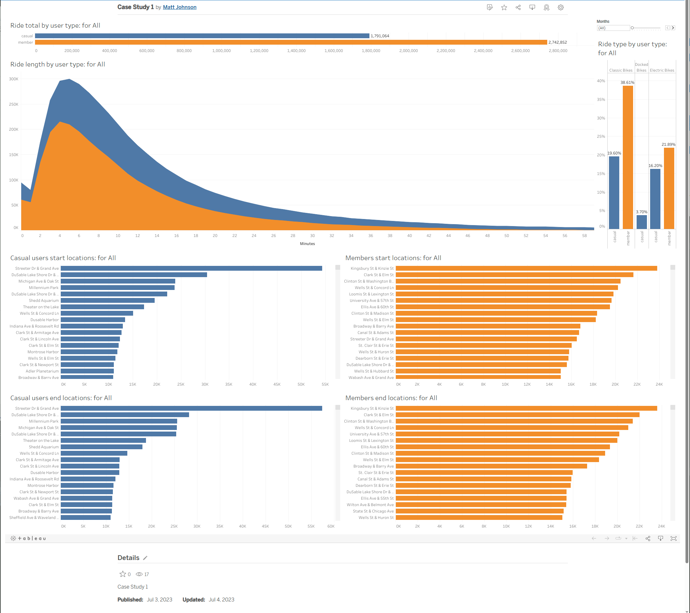

I decided to focus my data visualization on the question assigned by the stakeholders.

I then asked myself:

In what ways can I compare the rider types?

* by total rides: annually with a filter toggling months per rider type.
* by rider length/duration: annually with a filter toggling months per rider type.
* by start locations: annually with a filter toggling months split per rider type.
* by end locations: annually with a filter toggling months split per rider type.
* What are the rental stats of each bike offered in percentage split between rider types annually with a filter toggling months.

Those five questions covered the entirety of all the other sub-questions I asked myself.

[Tableau results](https://public.tableau.com/app/profile/matt.johnson.0304/viz/CaseStudy1_16884106053400/CaseStudy1)

 
